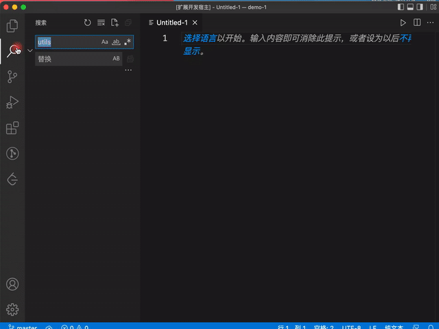

# vscode-fuzzy-search-plugin

## Description

每当想要在自己的文档库中检索内容的时候，由于 [vscode](https://github.com/microsoft/vscode) 不支持模糊搜索，导致每次检索的效率十分低下，不能快速找到自己想要的内容。

本项目基于 [lunr.js](https://lunrjs.com/) 实现的 [vscode](https://github.com/microsoft/vscode) 模糊搜索插件，适合为自己的 [vscode](https://github.com/microsoft/vscode) 项目增强搜索体验。

## Example

## Todo

* 搜索行为发生时，创建检索仓库改为启动插件时创建检索仓库。同时需要监听项目文件的变更，及时更新检索仓库
* 需要跳过搜索的文件，增加可配置功能
* 读取项目根目录下的.gitignore文件作为跳过搜索的文件列表
* 点击搜索结果时，打开对应文件的同时，选中并高亮搜索词
* 搜索面板增加增加输入框，类似原生搜索面板
* 搜索结果样式优化，增加颜色与搜索词高亮
* 搜索展示进度条
* 支持快捷键唤起搜索框
* 补齐ts类型
* 补充单元测试
